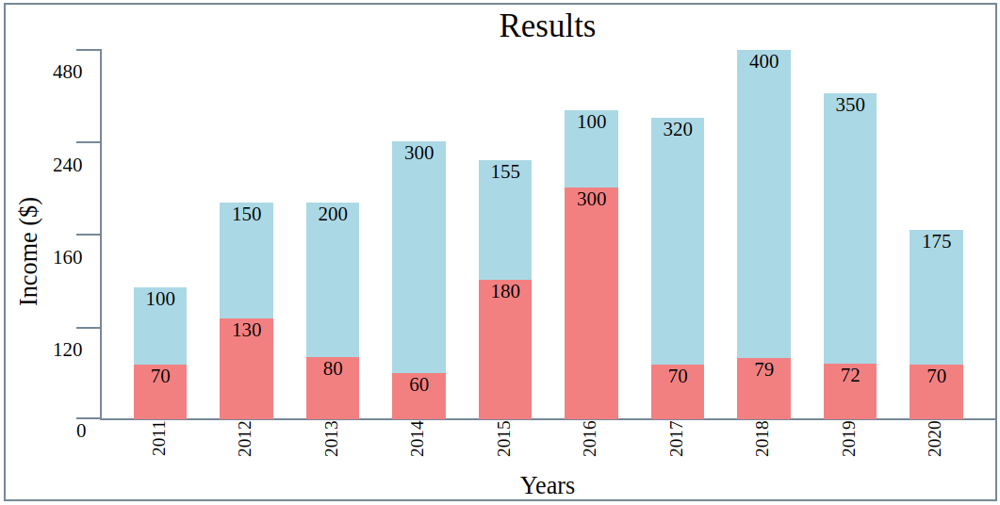
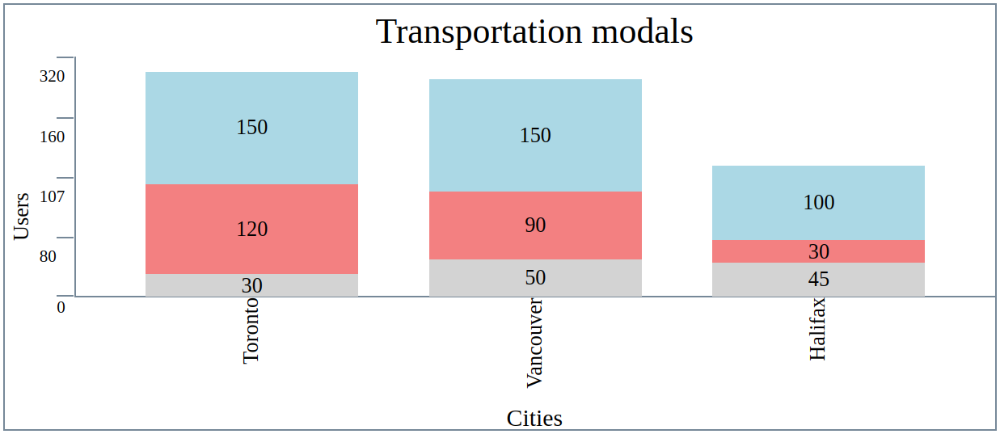
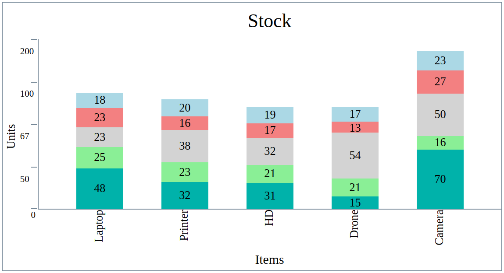

# About

This project is a stretch activity proposed in the Web Development preparation module from Lighthouse. It consisted of building a library to allow other developers to generate bar charts on their web pages using HTML, CSS and JavaScript. It also uses jQuery to access and manipulate the DOM in order to draw the charts.

## Example Screenshots





## drawBarChart function behavior

This is the main function to generate the charts. The function takes three parameters:
1. **data**: an array of objects. It is expected that the user informs both "label" and "values" keys. Each "label" key should be associated with a string value, while the "values" key should be associated with an array of numbers to be plotted. A third key, "sections", is set for an eventual further feature (the addition of a legend). The following code snippet shows the object that was passed to generate the second chart.
```
data = [
      { label: "Toronto", values: [150, 120, 30], sections: [] },
      { label: "Vancouver", values: [150, 90, 50], sections: [] },
      { label: "Halifax", values: [100, 30, 45], sections: [] },
    ];
```
2. **options**: an object. This parameter allows the user to customize the chart. It accepts a variety of keys:
  * chartWidth: a number is expected to specify the width of the desired chart.
  * chartHeight: a number is expected to specify the height of the desired chart.
  * title: a string is expected to be used as the chart's title.
  * titleHeight: a number is expected to specify the height of the chart's title.
  * titleColour: a string is expected to determine the colour of the title.
  * titleSize: a number is expected to choose the title's font-size.
  * yAxisWidth: a number is expected. This parameter represents the total width that will be occupied by the y-axis title and the ticks (values plus the tick itself).
  * yAxisTitle: a string is expected and will be used as the y-axis title.
  * yTitleSize: a number is expected to select the title's font-size.
  * yAxisTitleWidth: a number is expected to represent the y-axis' title width.
  * qTicks: a number is expected to select the number of ticks that the chart should have.
  * yTicksWidth: a number is expected as the width for the ticks.
  * tickValuesSize: a number is expected to select the tick values' font-size.
  * yValuesWidth: a number is expected to determine the width the should be occupied by the values on the y-axis.
  * plotWidth: a number is expected to be the plot area width.
  * plotHeight: a number is expected to be the plot area height.
  * plotValuesPosition: a string is expected as the position on which the bar values should be represented. The accepted values are "start", "center", and "top". If the value "start" is passed, the values will be located on the top of each bar. If the "end" parameter is passed, they will be located at the bottom of the bars.
  * plotValuesColour: a string is expected as the colour for the plot values.
  * plotValuesSize: a number is expected as the font-size of the plot values.
  * barColours: an array of strings is expected to determine the bars' colours. The array's length should match the number of values that the bar with most values has.
  * barSpacing: a number is expected to specify the white space between the bars.
  * labelColour: a string is expected to choose the colour of the labels.
  * labelsHeight: a number is expected to determine the height that should be reserved for the labels.
  * labelsSize: a number is expected as the labels' font-size.
  * xAxisTitle: a string is expected as the x-axis' title.
  * xTitleSize: a number is expected to determine the font-size of the x-axis' title.
  * xAxisTitleHeight: a number is expected to specify the height which should be occupied by the x-axis' title.

In case some of these options are missing, a default value will be set according to the following object:
```
const defaultOptions = {chartWidth: 700, chartHeight: 300, title: "", titleHeight: 45, titleColour: "black", titleSize: 25, yAxisWidth: 35, yAxisTitle: "", yTitleSize: 12, yAxisTitleWidth: 14, qTicks: 5, yTicksWidth: 10.5, tickValuesSize: 12, yValuesWidth: 10.5, plotWidth: 665, plotHeight: 210, plotValuesPosition: "start", plotValuesColour: "black", plotValuesSize: 15, barColours: ["lightblue", "lightcoral", "lightgray", "lightgreen", "lightseagreen", "crimson", "darkcyan", "darkgoldenrod", "orange", "purple"], barSpacing: 50, labelColour: "black", labelsHeight: 45, labelsSize: 15, xAxisTitle: "", xTitleSize: 12, xAxisTitleHeight: 14}
```

As an example, the following object is the one used to generate the second chart:

```
options = {
  title: "Transportation modals",
  yAxisTitle: "Users",
  yTitleSize: 15,
  yAxisWidth: 50,
  yAxisTitleWidth: 10,
  yTicksWidth: 5,
  yValuesWidth: 5,
  xAxisTitle: "Cities",
  labelsHeight: 90,
  xTitleSize: 17,
  xAxisTitleHeight: 25
};
```
3. **element**: a string. This parameter specifies where the chart should be printed. It is expected that the user creates an HTML element with a unique identifier attribute and pass in its id, like the following: `element = "#chart2"`

By calling the drawBarChart function, a series of sub-functions will run:
1. checkValues: receives the data and options parent's parameters and checks the values passed by the user. In case some options are missing, it will fill the object with default values. It also recalculates height and width parameters in case they are inconsistent. For example, if the sum of the elements' width is higher or lower than the chart's width, it will recalculate each element's width so that it matches the char's width. This function also reviews the white spaces between bars, verifies the bars' max values and sets the chart max value.
2. drawYAxis: receives the options parameter and draws the y-axis (y-title, tick values and tick marks).
3. drawTitle: receives the options parameter and draws the chart's title.
4. drawBars: receives the data and options parent's parameters and draws within the plotting area. It will draw the bars and print each bar's value accordingly.
5. drawLabels: receives the data and options parent's parameters and draw the labels for each bar on the x-axis.
6. drawXAxis: receives the options parameter and draw the x-axis title.
  // draw the x-axis title
After all the previous sub-functions run, the data, options and element parameters are reset so the user can create more than one chart on the same page.

## Known issues/bugs

Resizing the chart is a little tricky, because it usually demands changing different options' height, width and font-size so that the chart is presentable.

The x-axis is not completely aligned with the 0 tick on the y-axis.

## Future features

The code still does not support legend, which makes it impossible to understand which value represents each series in case of stacked bar charts.

## External resources

This website was built with the help material of the following sources:
* [jQuery_Learning_Center] (https://learn.jquery.com/)
* [W3Schools] (https://www.w3schools.com/)
* [Stack_Overflow] (https://stackoverflow.com/)
* [MDN_web_docs] (https://developer.mozilla.org/en-US/)
* [GitHub_docs] (https://docs.github.com/en)
